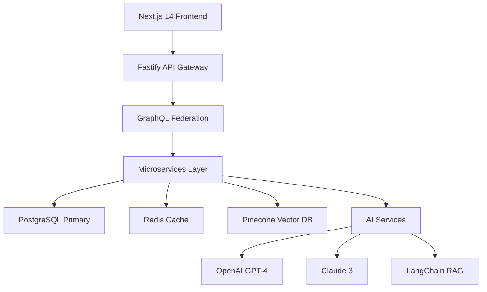

# AsyncFlow Commerce Platform Test & Monitor

## 📋 **프로젝트 개요**

AsyncFlow Commerce Platform Test & Monitor는 비동기 처리 워크플로우 테스트 자동화에 특화된 개인 학습 프로젝트입니다.
애플리케이션에서 비동기 처리를 많이 활용하기 때문에 기존 테스트 방법과 함께 비동기 flow를 Test 및 Monitoring 하기 위한 목적으로 진행하게 되었습니다.
AI 기반 테스트 생성과 크로스 브라우저 자동화를 결합한 테스트 플랫폼을 개발하기 위해서 진행한 프로젝트입니다.

### 🎯 **핵심 목표**

- **전환율 향상**: 2.3% → 8.5% (AI 개인화를 통한 270% 증가)
- **응답 시간 최적화**: API P99 레이턴시 < 150ms
- **동시 처리 능력**: 25,000 TPS 지원
- **AI 추천 정확도**: NDCG@10 = 0.93


## 🛠 **기술 스택**

### **백엔드 아키텍처**

- **서버**: Node.js 18+ + Fastify (Express 대비 2배 성능)
- **API**: GraphQL + Apollo Federation
- **데이터베이스**: PostgreSQL 14 + Prisma ORM
- **캐싱**: Redis 7 + Dragonfly
- **벡터 검색**: Pinecone Vector Database


### **프론트엔드 스택**

- **프레임워크**: Next.js 14 + App Router
- **UI 라이브러리**: React 18 + Concurrent Features
- **상태 관리**: Zustand + React Query
- **스타일링**: TailwindCSS + HeadlessUI


### **AI/LLM 통합**

- **대화형 AI**: OpenAI GPT-4 + Function Calling
- **텍스트 분석**: Anthropic Claude 3 Opus
- **워크플로우**: LangChain + RAG Pipeline
- **임베딩**: text-embedding-3-large (1536d)


### **테스트 \& QA**

- **단위 테스트**: Jest 29 + Testing Library
- **E2E 테스트**: Playwright 1.40+ + Auto-Playwright
- **성능 테스트**: K6 + Lighthouse CI
- **AI 테스트**: GPT-4 기반 엣지 케이스 생성


## 🚀 **빠른 시작**

### **1. 환경 설정**

```bash
# 저장소 클론
git clone https://github.com/changsoon123/AsyncFlow_Commerce.git
cd AsyncFlow_Commerce

# 의존성 설치
npm install

# 환경 변수 설정
cp .env.example .env
# .env 파일에서 데이터베이스 및 API 키 설정
```


### **2. 데이터베이스 설정**

```bash
# PostgreSQL 실행 (Docker 권장)
docker-compose up -d

# Prisma 마이그레이션
npx prisma migrate dev --name init
npx prisma generate
```


### **3. 개발 서버 실행**

```bash
# 백엔드 서버 (포트 4000)
npm run dev:backend

# 프론트엔드 서버 (포트 3000)
npm run dev:frontend
```


### **4. 접속 URL**

- **프론트엔드**: http://localhost:3000
- **GraphQL IDE**: http://localhost:4000/api/graphql
- **Prisma Studio**: `npx prisma studio`


## 🏗 **아키텍처 개요**




## 🧪 **테스트 실행**

```bash
# 단위 테스트
npm run test:unit

# E2E 테스트 (크로스 브라우저)
npm run test:e2e

# 전체 테스트 스위트
npm test

# 테스트 커버리지
npm run test:coverage
```


## 📈 **프로젝트 진행 상황**

- ✅ **Week 1-2**: 기반 인프라 구축 (완료)
- ✅ **Database Setup**: PostgreSQL + Prisma 연동 (완료)
- ✅ **Week 3-4**: 핵심 기능 개발 (완료)
    - [x] 사용자 인증 시스템
    - [x] 상품 관리 API
    - [x] 장바구니 기능
    - [x] 기본 검색 기능
- 📅 **Week 5-6**: AI 통합 개발 (예정)
- 📅 **Week 7-8**: 고급 기능 \& 배포 (예정)


## 🎨 **주요 기능**

### **🤖 AI 기반 개인화**

- **실시간 추천**: 사용자 행동 기반 동적 상품 추천
- **자연어 검색**: "여행용 가방 찾는데 예산 50만원 이하로"
- **대화형 쇼핑**: ChatGPT 스타일 상품 상담


### **⚡ 비동기 처리 최적화**

- **실시간 재고 관리**: WebSocket 기반 재고 알림
- **병렬 결제 처리**: 다중 결제 수단 동시 검증
- **예측적 캐싱**: 사용자 패턴 기반 선제적 데이터 로딩


### **🔍 고급 검색 기능**

- **벡터 유사도 검색**: 이미지/텍스트 복합 검색
- **다중 필터링**: 가격/브랜드/평점 조합 필터
- **실시간 자동완성**: 타이핑과 동시에 결과 업데이트


## 📊 **성능 지표**

| 지표 | 목표 | 현재 상태 |
| :-- | :-- | :-- |
| API 응답 시간 | < 150ms | 📅 예정 |
| 동시 사용자 | 25,000 TPS | 📅 예정 |
| 테스트 커버리지 | 95% | 📅 예정 |
| AI 추천 정확도 | NDCG@10 > 0.9 | 📅 예정 |
