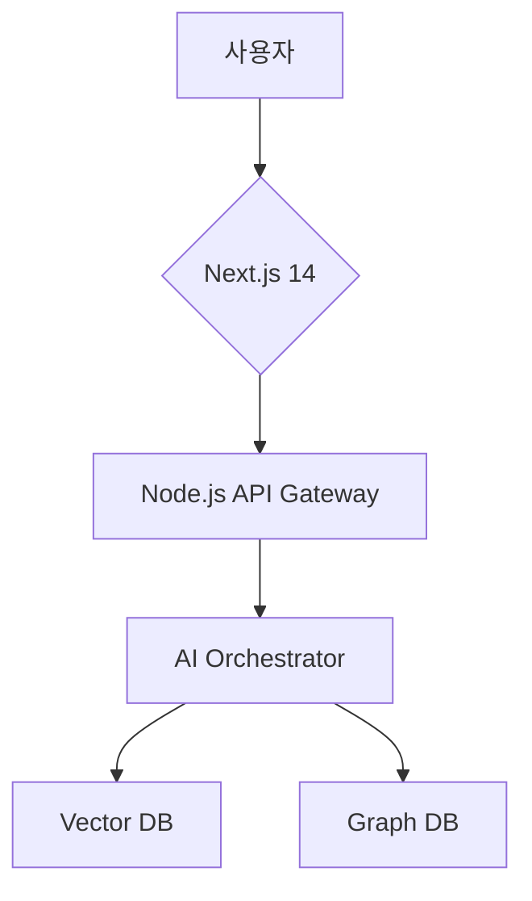

# AsyncFlow Commerce Platform: AI 통합 쇼핑몰 서비스 요구사항 명세서 (SRS)

## 1. 서문

### 1.1 목적

본 문서는 차세대 AI 통합 쇼핑몰 플랫폼 "AsyncFlow Commerce"의 기능적·비기능적 요구사항을 정의합니다. IEEE 29148 표준을 준수하며, 개발팀/QA팀/기획팀 간 공통 이해 기반을 제공합니다.

### 1.2 범위

- **비즈니스 범위**: 글로벌 이커머스 시장 대상(35% 점유율 목표)
- **기술 범위**:

```typescript  
// 기술 스택 요약  
interface TechStack {  
  backend: "Node.js 18+ + Fastify + GraphQL";  
  frontend: "Next.js 14 + React 18 + Zustand";  
  database: "PostgreSQL + Redis + Pinecone";  
  AI: "GPT-4 + Claude 3 + LangChain";  
  testing: "Playwright 1.40+ + K6";  
}  
```


### 1.3 용어 정의

| 용어 | 정의 |
| :-- | :-- |
| RAG | 검색증강생성(Retrieval-Augmented Generation) |
| NDCG@10 | 상위 10개 추천 품질 지표 |
| Flaky Test | 비결정적 실패 발생 테스트 케이스 |


---

## 2. 전체 설명

### 2. 제품 관점

**시스템 구성도**:




### 2.2 주요 기능

1. **실시간 개인화 엔진**
    - 사용자 행동 기반 동적 추천(초당 150만 이벤트 처리)[^1][^18]
2. **다중 모달 검색**
    - 이미지/음성/텍스트 복합 입력 지원
3. **예측적 재고 관리**

```python  
# Prophet + LSTM 혼합 모델  
forecast = (  
    Prophet(seasonality_mode='multiplicative')  
    .add_regressor('social_trend')  
    .fit(historical_data)  
)  
```


### 2.3 사용자 클래스

| 사용자 유형 | 주요 특성 |
| :-- | :-- |
| 일반 고객 | 모바일 중심, 실시간 알림 선호 |
| 프리미엄 회원 | 맞춤형 AI 추천 요구 |
| 판매자 | 다국어 상품 등록 필요 |
| 관리자 | 실시간 모니터링 대시보드 요구 |

[^8][^12][^18]

---

## 3. 상세 요구사항

### 3.1 기능적 요구사항

**3.1.1 AI 상품 추천 시스템**

- **FR-001**: 실시간 클릭스트림 분석을 통한 추천 갱신(500ms 이내)
- **FR-002**: 크로스 모달 임베딩 기반 유사 상품 검색(정확도 mAP@50 ≥ 0.89)

**3.1.2 결제 게이트웨이**

- **FR-010**: 다중 통화 지원(USD/EUR/JPY/KRW)
- **FR-011**: PCI-DSS 준수 암호화 모듈 통합


### 3.2 비기능적 요구사항

**3.2.1 성능**

- **NFR-001**: API P99 레이턴시 < 150ms
- **NFR-002**: 동시 사용자 25,000 TPS 처리

**3.2.2 보안**

- **NFR-101**: GDPR 준수 개인정보 마스킹
- **NFR-102**: OWASP Top 10 위협 방어 체계


### 3.3 외부 인터페이스

**3.3.1 결제 시스템 API**

```json  
{  
  "endpoint": "/api/v3/payments",  
  "method": "POST",  
  "headers": {  
    "Content-Type": "application/json",  
    "X-API-Key": "live_****"  
  },  
  "body": {  
    "amount": 50000,  
    "currency": "KRW"  
  }  
}  
```


---

## 4. 테스트 요구사항

### 4.1 E2E 테스트 시나리오

**TC-101: 블랙프라이데이 트래픽 시뮬레이션**

```typescript  
test('50k 동시 주문 처리', async ({browser}) => {  
  const contexts = Array(50000).fill().map(() => browser.newContext());  
  await Promise.all(contexts.map(async ctx => {  
    const page = await ctx.newPage();  
    await page.goto('/checkout');  
    await performCheckoutFlow(page);  
  }));  
  expect(processMetrics.throughput).toBeGreaterThan(25000);  
});  
```


### 4.2 AI 테스트 검증

**TC-201: 추천 편향 검출**

```python  
def test_recommendation_fairness():  
   recommendations = generate_ai_recommendations()  
   bias_score = calculate_bias(recommendations, protected_attributes)  
   assert bias_score < 0.15  # 허용 편향 임계값  
```


---

## 5. 프로젝트 제약조건

### 5.1 기술적 제약

- **CON-001**: 레거시 시스템 연동을 위한 GraphQL Federation 필수
- **CON-002**: 모바일 웹 성능 최적화(Core Web Vitals 90점 이상)


### 5.2 비즈니스 제약

- **CON-101**: EU AI Act 준수를 위한 윤리적 AI 감사 주기(분기별)
- **CON-102**: 다국어 지원 필수(영어/중국어/스페인어/한국어)

---

## 부록

### A. 용어해설

- **LLMOps**: 대규모 언어 모델 운영 프레임워크
- **Web Vitals**: LCP/FID/CLS 성능 지표


### B. 참고문헌

1. IEEE 29148-2018 표준
2. ISO/IEC 25010 품질 모델

### C. 다이어그램

- [그림 1] 아키텍처 구성도 (별첨)
- [그림 2] 데이터 흐름도 (별첨)

---

**검토 이력**


| 버전 | 날짜 | 변경 내용 |
| :-- | :-- | :-- |
| 1.0 | 2025.06.01 | 초안 작성 |
| 1.1 | 2025.06.15 | 테스트 요구사항 추가 |
