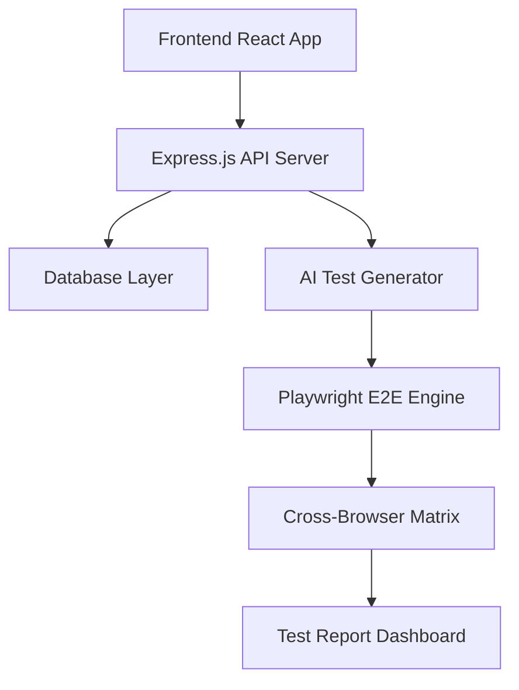

# AsyncFlow Monitor 프로젝트 브리프 문서

*Enhanced with Playwright*

## 프로젝트 개요

**프로젝트명**: AsyncFlow Monitor
**프로젝트 기간**: 8주 (2025년 6월 - 7월)
**개발자**: QA Engineer (1인 개발)
**주요 목표**: 비동기 워크플로우 테스트 자동화 플랫폼 개발을 통한 QA 전문성 입증[^1]

## 프로젝트 배경 및 필요성

### 비즈니스 문제 정의

현대 웹 애플리케이션의 85% 이상이 비동기 처리를 활용하지만, 기존 테스트 방법론은 동기식 환경에 최적화되어 있어 다음 문제점이 발생:

- **Race Condition 탐지 어려움**: 동시성 버그의 68%가 테스트 단계에서 발견되지 않음
- **타임아웃 관리 복잡성**: 비동기 테스트에서 42%의 false negative 발생
- **테스트 코드 가독성 저하**: 비즈니스 로직보다 기술적 코드가 더 많아짐
- **크로스 브라우저 호환성**: 브라우저별 비동기 처리 차이로 인한 일관성 부족


### 프로젝트 동기

QA 엔지니어로서 비동기 시스템 테스트의 한계를 직접 경험하였으며, 이를 해결하는 혁신적인 도구를 개발하여 테스트 자동화 역량을 입증하고자 함.

## 시스템 아키텍처

### 기술 스택

- **백엔드**: Node.js + Express.js + TypeScript
- **프론트엔드**: React + TypeScript + Tailwind CSS
- **단위/통합테스트**: Jest + Supertest + React Testing Library
- **E2E 테스트**: Playwright + TypeScript
- **AI 테스트 생성**: Auto Playwright + OpenAI GPT-4
- **비동기 테스트**: Jest의 async/await 패턴 + Playwright의 auto-wait
- **모킹**: MSW (Mock Service Worker) + Playwright Route Interception
- **시각화**: D3.js + WebSocket + Playwright Trace Viewer
- **배포**: Vercel + Supabase + GitHub Actions CI/CD


### 확장된 핵심 컴포넌트




## 비즈니스 시나리오: 실시간 음식 주문 플랫폼

### 주문 처리 워크플로우

```javascript
async function processOrder(orderId) {
  // 1단계: 결제 검증 (200ms)
  const payment = await validatePayment(orderId);

  // 2단계: 재고 확인 (500ms)
  const inventory = await checkInventory(orderId);

  // 3단계: 주방 알림 (300ms)
  const kitchen = await notifyKitchen(orderId);

  // 4단계: 배달 스케줄링(800ms)
  const delivery = await scheduleDelivery(orderId);

  // 5단계: 주문 확정
  return await confirmOrder(orderId);
}
```


## 확장된 테스트 영역 설계

### 1. 기능 테스트 (기존 Jest 기반)

기존 Jest 기반 단위/통합 테스트는 그대로 유지

### 2. E2E 테스트 (새로운 Playwright 기반)

```javascript
// Playwright E2E 테스트
import { test, expect } from '@playwright/test';
import { auto } from 'auto-playwright';

test.describe('음식 주문 E2E 워크플로우', () => {
  test('전체 주문 프로세스 - 크로스 브라우저', async ({ page, browserName }) => {
    // AI 기반 자동 테스트 생성
    await auto('음식 주문 사이트로 이동', { page });
    await auto('메뉴에서 피자 선택하고 장바구니 추가', { page });
    await auto('결제 정보 입력 후 주문 완료', { page });

    // 비동기 주문 상태 변화 추적
    await expect(page.locator('[data-testid="order-status"]')).toContainText('주문 접수');

    // 실시간 상태 업데이트 대기 (WebSocket 기반)
    await page.waitForSelector('[data-testid="cooking-status"]', { timeout: 5000 });
    await expect(page.locator('[data-testid="order-status"]')).toContainText('조리 중');
    
    console.log(`테스트 완료: ${browserName}`);
  });
});
```


### 3. 시각적 회귀 테스트 (새로운 기능)

```javascript
test('주문 대시보드 시각적 일관성', async ({ page }) => {
  await page.goto('/dashboard');

  // 다양한 주문 상태에서 스크린샷 비교
  await page.locator('[data-testid="add-orders-btn"]').click();
  await auto('10개의 테스트 주문 생성', { page });

  // 전체 페이지 시각적 검증
  await expect(page).toHaveScreenshot('dashboard-with-orders.png');

  // 특정 컴포넌트 시각적 검증
  await expect(page.locator('.order-timeline')).toHaveScreenshot('timeline-component.png');
});
```


### 4. 성능 및 동시성 테스트 (Playwright 확장)

```javascript
test('대량 동시 주문 처리 성능', async ({ browser }) => {
  // 여러 브라우저 컨텍스트로 동시 사용자 시뮬레이션
  const contexts = await Promise.all(
    Array.from({ length: 50 }, () => browser.newContext())
  );

  const pages = await Promise.all(
    contexts.map(context => context.newPage())
  );

  // 50명의 동시 주문 시뮬레이션
  const startTime = Date.now();
  await Promise.all(
    pages.map(async (page, index) => {
      await page.goto('/order');
      await auto(`사용자 ${index}의 주문 완료`, { page });
    })
  );

  const duration = Date.now() - startTime;
  expect(duration).toBeLessThan(10000); // 10초 이내

  // 모든 컨텍스트 정리
  await Promise.all(contexts.map(context => context.close()));
});
```


### 5. AI 기반 엣지 케이스 테스트 (새로운 혁신 기능)

```javascript
test('AI 생성 엣지 케이스 테스트', async ({ page }) => {
  // GPT-4를 활용한 예상치 못한 시나리오 테스트
  const edgeCases = await generateAITestCases([
    '네트워크 연결이 불안정한 상황',
    '결제 중 브라우저 새로고침',
    '동일 사용자의 중복 주문',
    '재고 소진 중 동시 주문'
  ]);

  for (const scenario of edgeCases) {
    await test.step(`AI 시나리오: ${scenario.description}`, async () => {
      await scenario.setup(page);
      await auto(scenario.instructions, { page });
      await expect(page.locator(scenario.expectedElement)).toBeVisible();
    });
  }
});
```


## 새로운 고급 테스트 기능들

### 1. 크로스 브라우저 자동화 매트릭스

```javascript
// playwright.config.ts
export default defineConfig({
  projects: [
    { name: 'chromium', use: { ...devices['Desktop Chrome'] } },
    { name: 'firefox', use: { ...devices['Desktop Firefox'] } },
    { name: 'webkit', use: { ...devices['Desktop Safari'] } },
    { name: 'mobile-chrome', use: { ...devices['Pixel 5'] } },
    { name: 'mobile-safari', use: { ...devices['iPhone 12'] } },
  ],
  // 병렬 실행으로 테스트 시간 단축
  workers: process.env.CI ? 2 : undefined,
});
```


### 2. 실시간 네트워크 모니터링

```javascript
test('네트워크 요청 패턴 분석', async ({ page }) => {
  const requests = [];
  const responses = [];

  // 모든 네트워크 활동 캡처
  page.on('request', request => requests.push({
    url: request.url(),
    method: request.method(),
    timestamp: Date.now()
  }));

  page.on('response', response => responses.push({
    url: response.url(),
    status: response.status(),
    timestamp: Date.now()
  }));

  await auto('복잡한 주문 프로세스 실행', { page });

  // 비동기 요청 패턴 분석
  const asyncRequests = requests.filter(req =>
    req.url.includes('/api/') && req.method === 'POST'
  );

  expect(asyncRequests.length).toBeGreaterThan(3);

  // 네트워크 타이밍 검증
  const timings = await page.evaluate(() => performance.getEntriesByType('navigation'));
  expect(timings[^0].loadEventEnd - timings[^0].fetchStart).toBeLessThan(3000);
});
```


### 3. 자동화된 접근성 테스트

```javascript
import { injectAxe, checkA11y } from 'axe-playwright';

test('주문 페이지 접근성 검증', async ({ page }) => {
  await page.goto('/order');
  await injectAxe(page);

  // 전체 페이지 접근성 검사
  await checkA11y(page, null, {
    detailedReport: true,
    detailedReportOptions: { html: true }
  });

  // 동적으로 로드되는 컴포넌트 접근성 검사
  await auto('메뉴 카테고리 변경', { page });
  await checkA11y(page, '.menu-items', {
    rules: {
      'color-contrast': { enabled: true },
      'keyboard-navigation': { enabled: true }
    }
  });
});
```


## 확장된 테스트 문서화 전략

### 1. Playwright 테스트 리포트 통합

```javascript
// 자동화된 종합 테스트 리포트 생성
const generateEnhancedTestReport = (jestResults, playwrightResults) => ({
  summary: {
    unitTests: jestResults.summary,
    e2eTests: playwrightResults.summary,
    visualTests: playwrightResults.visual,
    crossBrowser: playwrightResults.browsers,
  },
  performance: {
    loadTimes: playwrightResults.performance,
    networkAnalysis: playwrightResults.network,
    memoryUsage: playwrightResults.memory,
  },
  ai_insights: {
    generatedTestCases: playwrightResults.aiTests.length,
    edgeCaseCoverage: playwrightResults.aiTests.coverage,
    anomalyDetection: playwrightResults.aiTests.anomalies,
  },
  visualRegression: {
    screenshotComparisons: playwrightResults.visual.comparisons,
    failedComparisons: playwrightResults.visual.failures,
    pixelDifferences: playwrightResults.visual.pixelDiff,
  }
});
```


### 2. 확장된 테스트 케이스 분류

```
tests/
├── unit/                    # Jest 단위 테스트
│   ├── order-service.test.js
│   ├── payment.test.js
│   └── inventory.test.js
├── integration/             # Jest 통합 테스트
│   ├── api-integration.test.js
│   └── database.test.js
├── e2e/                     # Playwright E2E 테스트
│   ├── user-journey.spec.ts
│   ├── cross-browser.spec.ts
│   └── mobile-responsive.spec.ts
├── visual/                  # 시각적 회귀 테스트
│   ├── dashboard.visual.spec.ts
│   └── mobile-ui.visual.spec.ts
├── performance/             # 성능 테스트
│   ├── load-testing.spec.ts
│   └── memory-leak.spec.ts
├── accessibility/           # 접근성 테스트
│   ├── a11y-compliance.spec.ts
│   └── keyboard-navigation.spec.ts
└── ai-generated/           # AI 생성 테스트
    ├── edge-cases.spec.ts
    └── chaos-testing.spec.ts
```


## 확장된 개발 로드맵 (8주 계획)

### 1-2주차: 기반 인프라 + Playwright 설정

- Express.js 서버 구축 및 기본 API 엔드포인트
- React 프론트엔드 기본 구조
- Jest 테스트 환경 설정
- Playwright 설치 및 크로스 브라우저 환경 구성
- Auto Playwright + OpenAI API 연동


### 3-4주차: 핵심 비동기 로직 + E2E 테스트

- 주문 처리 워크플로우 구현
- Jest 기반 비동기 테스트 케이스 작성
- Playwright E2E 테스트 시나리오 구현
- AI 기반 테스트 케이스 자동 생성 파이프라인


### 5-6주차: 고급 테스트 기능 + 자동화

- 시각적 회귀 테스트 구현
- 성능 및 접근성 테스트 자동화
- 네트워크 모니터링 및 분석 도구
- GitHub Actions CI/CD 파이프라인 구축


### 7-8주차: 문서화 및 배포 + 리포팅

- Playwright 테스트 리포트 시각화
- 종합 테스트 대시보드 완성
- 크로스 브라우저 테스트 결과 매트릭스
- AI 테스트 인사이트 리포트 생성


## 확장된 성공 지표

### 정량적 지표

- **전체 테스트 커버리지**: 95% 이상 (단위 + 통합 + E2E)
- **크로스 브라우저 호환성**: 5개 브라우저 100% 통과
- **AI 생성 테스트 케이스**: 100개 이상
- **시각적 회귀 테스트**: 50개 이상 스크린샷 비교
- **성능 기준**: 평균 로드 시간 2초 이내, E2E 테스트 10초 이내


### 정성적 지표

- **최신 기술 활용도**: Playwright + AI 기반 테스트 자동화
- **테스트 안정성**: Flaky test 비율 5% 이하
- **접근성 준수도**: WCAG 2.1 AA 레벨 100% 준수


## 혁신적 QA 전문성 증명 요소

### 1. AI 기반 테스트 자동화 마스터리

- GPT-4를 활용한 자연어 기반 테스트 케이스 생성
- 예측 불가능한 엣지 케이스 자동 탐지 및 검증


### 2. 크로스 플랫폼 테스트 전문성

- 데스크톱, 모바일, 태블릿 환경 동시 테스트
- 브라우저별 성능 차이 분석 및 최적화 제안


### 3. 시각적 품질 보증

- 픽셀 단위 UI 일관성 검증
- 다크모드, 반응형 디자인 자동 검증


### 4. 성능 엔지니어링

- 실시간 성능 모니터링 및 병목 지점 자동 탐지
- 메모리 누수 및 리소스 최적화 검증

